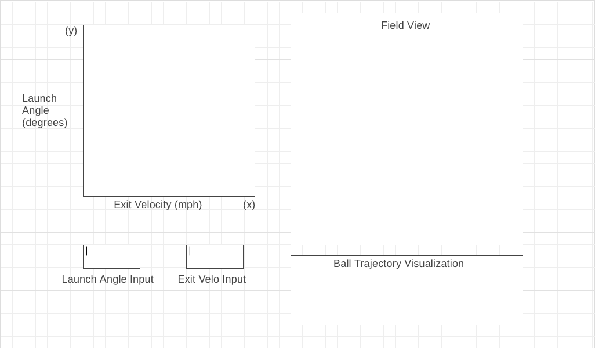

# Baseball Visualizer Project

### Background and Overview

In 2015 all Major League Baseball stadiums were equipped with new tools to gain very rich, precise, and accurate data on how the game of baseball is being played today. These new technologies have been the cornerstone of new advancements in baseball training techniques, equipment, and more visually intriguing ways of captivating fans. 

Since 2015, there have been several columns of new data types being added to the vast list of baseball's tracked history. With these new forms of information teams have been able to uncover hidden gems of baseball and are getting closer to understanding the root mechanics of the game and how it can be improved. 

Many of the most exciting stats are coming from new batting and pitching statistics like Exit Velocity, Launch Angle, and Pitch FX. This project is going to use these new metrics to demonstrate and highlight how powerful this data can be for simulating and visualizing the outcomes of situational moments within the game.

### Functionality & MVP

In the baseball hit visualizer, users will be able to:

* Choose a launch angle and exit velocity of a ball put into play
* See the ending location of where the ball was fielded or landed
* See a spray chart of balls in play
* Track the location of the ball with a projected trajectory
* Select data sets based types of balls in play

### Wireframes

    

### Architecture & Technology

* Javascript
* Canvas
* D3.js

### Implementation Timeline

#### Day 1
* Acquiring Data
* Research on D3 and Canvas
* Building out skeleton
#### Day 2 
* Build calculations for ball landing points
* Start building out the rendering aspect
* Start calculations for projected ball trajectory
#### Day 3
* Refining calculations 
* Refining renders of data visualizations
#### Day 4
* Add user functionality with interactive selectors
* Add input fields for specfic data point visualization
#### Day 5
* Cleaning up UI/UX 

### Bonus Features
    
* Pitch Visualizations from the catcher's perspective
* Strikezone heatmaps